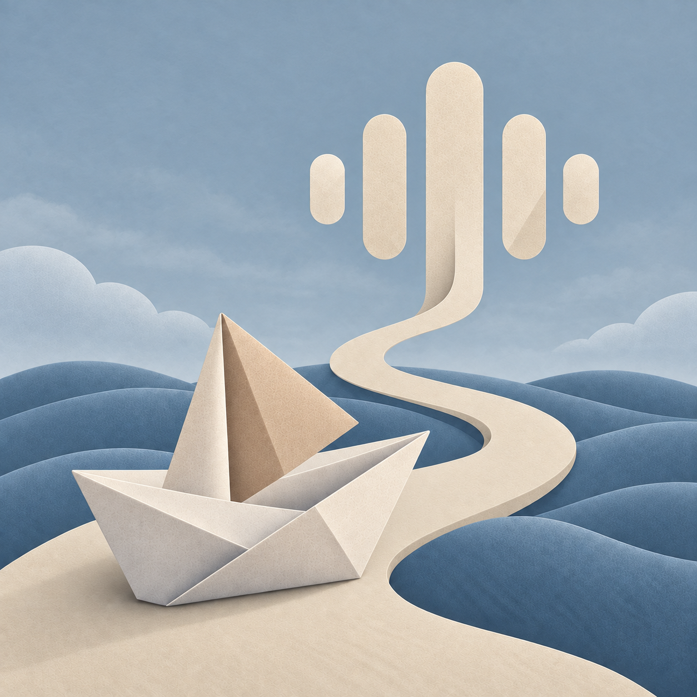

# Storymile

A podcast app for Android, Desktop, iOS, and web, with support for custom generated
episodes in your library. Built with Kotlin Multiplatform and
[App Platform](https://github.com/vRallev/app-platform).

 

## Contributing

See [AGENTS.md](AGENTS.md) for project structure, setup, and testing.

## License

Copyright 2026 Ralf Wondratschek.

Licensed under the [Apache License 2.0](LICENSE).
