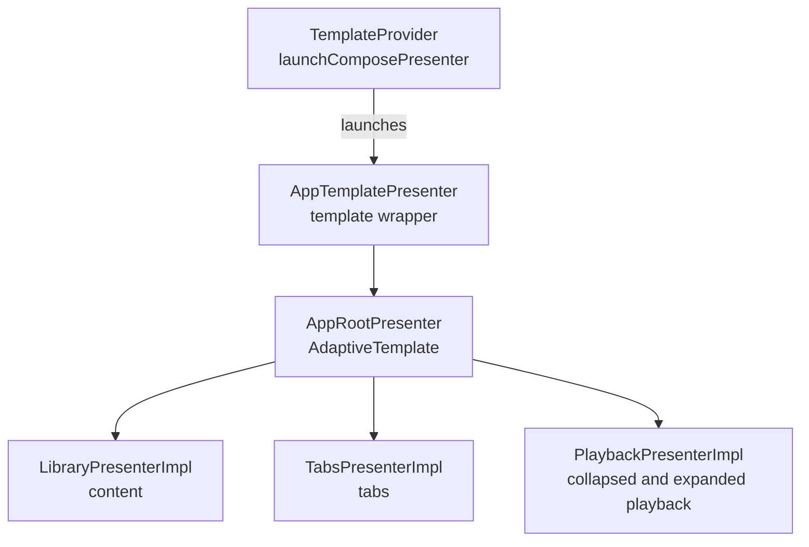

# Presenter hierarchy

Storymile uses the same presenter tree on Android, Desktop, iOS, and Wasm.
Phone and tablet layouts share this tree. Renderers place the template slots for the available window.

## Presenter tree

The first arrow starts the root presenter. The other arrows are direct `present(Unit)` calls.
Feature interfaces are injected into `AppRootPresenter`. Metro supplies their implementations.
There are no presenter backstacks or conditional child presenters yet.

## Root and lifecycle

- [TemplateProvider](../app-framework/impl/src/commonMain/kotlin/software/ralf/storymile/TemplateProvider.kt) launches `AppTemplatePresenter` in its own `ComposePresenterScope`. It exposes the resulting `StateFlow<AppTemplate>`. Its `cancel()` method stops that scope.
- [AppTemplatePresenter](../templates/public/src/commonMain/kotlin/software/ralf/storymile/templates/AppTemplatePresenter.kt) provides `LocalBackGestureDispatcherPresenter`, calls the root, and converts its model with `toAppTemplate()`. An explicit `AppTemplate` passes through this wrapper.
- [AppRootPresenter](../app-framework/impl/src/commonMain/kotlin/software/ralf/storymile/approot/AppRootPresenter.kt) calls all three feature presenters and returns `AppTemplate.AdaptiveTemplate`.

The back-gesture dispatcher supplies shared back handling outside the feature tree.

## Feature models and template slots

| Presenter implementation | Model | Template slot |
| --- | --- | --- |
| [LibraryPresenterImpl](../library/impl/src/commonMain/kotlin/software/ralf/storymile/library/LibraryPresenterImpl.kt) | `LibraryPresenterImpl.Model` | `content` |
| [TabsPresenterImpl](../tabs/impl/src/commonMain/kotlin/software/ralf/storymile/tabs/TabsPresenterImpl.kt) | `TabsPresenterImpl.Model` | `tabs` |
| [PlaybackPresenterImpl](../playback/impl/src/commonMain/kotlin/software/ralf/storymile/playback/PlaybackPresenterImpl.kt) | `PlaybackPresenterImpl.BarModel` | `playback` |
| `PlaybackPresenterImpl` | `PlaybackPresenterImpl.ScreenModel` | `expandedPlayback` |

[PlaybackPresenter.Model](../playback/public/src/commonMain/kotlin/software/ralf/storymile/playback/PlaybackPresenter.kt)
contains both `collapsed` and `expanded` models. `AppRootPresenter` puts these models into the two
playback slots. Both models are outputs of one presenter.

All feature contents are empty for now. The root leaves `overlay` absent.
[AppTemplate](../templates/public/src/commonMain/kotlin/software/ralf/storymile/templates/AppTemplate.kt)
uses `BaseModel` for its slots and has no dependency on the playback or tabs modules.

## Adaptive rendering

[AppTemplateRenderer](../templates/impl/src/commonMain/kotlin/software/ralf/storymile/templates/AppTemplateRenderer.kt)
reports window dimensions to the app-scoped
[DefaultScreenSizeProvider](../templates/impl/src/commonMain/kotlin/software/ralf/storymile/screen/DefaultScreenSizeProvider.kt).
The provider starts at `ScreenSize.Zero` and publishes changes through
[ScreenSizeProvider.screenSize](../templates/public/src/commonMain/kotlin/software/ralf/storymile/screen/ScreenSizeProvider.kt).
Presenters can observe this flow when window size affects their models or navigation.
The current feature presenters do not observe it.

The template renderer provides `LocalScreenSize` to child renderers. It selects tabs placement as follows:

| Condition, in priority order | Placement |
| --- | --- |
| Window width is at least `1200.dp` | Expanded sidebar |
| Smaller width and category is `PHONE` | Bottom tabs |
| Otherwise | Side rail |

[ScreenSize](../templates/public/src/commonMain/kotlin/software/ralf/storymile/screen/ScreenSize.kt)
classifies the shorter window side: phone below `600.dp`, small tablet below `840.dp`, and large
tablet otherwise. Orientation is landscape when width exceeds height; otherwise it is portrait.
Sidebar expansion uses width independently of this category.

Playback expansion is renderer state. The template uses Material 3 `BottomSheetScaffold` to expand
the sheet and collapse it with a drag, Back, or Escape. Expansion keeps the presenter tree unchanged.
Phone tabs slide down as playback rises. Side tabs remain behind the sheet.

## Maintenance

When you create a presenter, add it to this file. Update the tree, model-to-slot mapping, and source
links when presenter composition, navigation, or template slots change. Document conditional
branches when phone and tablet behavior produces different presenter trees.
