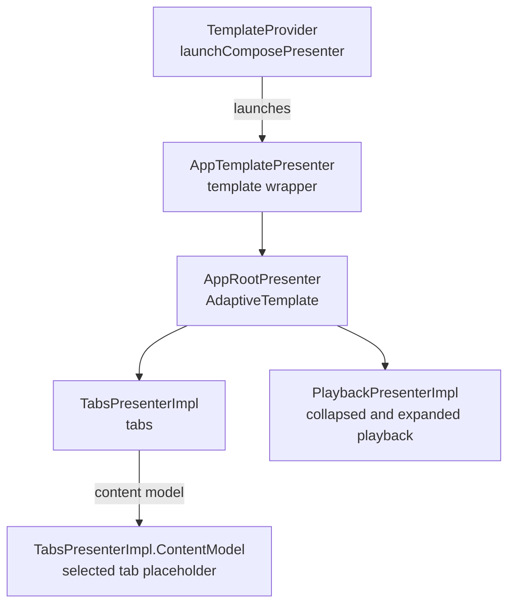

# Presenter hierarchy

Storymile uses the same presenter tree on Android, Desktop, iOS, and Wasm.
Phone and tablet layouts share this tree. Renderers place the template slots for the available window.

## Presenter tree

## Composition

[TemplateProvider](../app-framework/impl/src/commonMain/kotlin/software/ralf/storymile/TemplateProvider.kt)
starts the presenter tree.
[AppTemplatePresenter](../templates/public/src/commonMain/kotlin/software/ralf/storymile/templates/AppTemplatePresenter.kt)
wraps the app root with shared template support.

[AppRootPresenter](../app-framework/impl/src/commonMain/kotlin/software/ralf/storymile/approot/AppRootPresenter.kt)
composes the
[tabs](../tabs/impl/src/commonMain/kotlin/software/ralf/storymile/tabs/TabsPresenterImpl.kt) and
[playback](../playback/impl/src/commonMain/kotlin/software/ralf/storymile/playback/PlaybackPresenterImpl.kt)
presenters. The tabs presenter owns the selected destination and produces its content model.
It starts with Home.
[TabContentRenderer](../tabs/impl/src/commonMain/kotlin/software/ralf/storymile/tabs/TabContentRenderer.kt)
shows only the selected tab's name until feature screens are added.
The app root places these models in the content, navigation, and playback slots of
[AppTemplate](../templates/public/src/commonMain/kotlin/software/ralf/storymile/templates/AppTemplate.kt).

## Adaptive rendering

[AppTemplateRenderer](../templates/impl/src/commonMain/kotlin/software/ralf/storymile/templates/AppTemplateRenderer.kt)
places the template slots for the available window. It adapts navigation placement and playback
presentation while keeping the shared presenter tree. Use the linked source files for model details
and layout rules.

[TabsRenderer](../tabs/impl/src/commonMain/kotlin/software/ralf/storymile/tabs/TabsRenderer.kt)
shows Home, Library, and Downloads with Material icons in every navigation layout.
Side navigation also shows the Storymile logo and title.
Window resizing changes the navigation layout without changing the selected destination.
